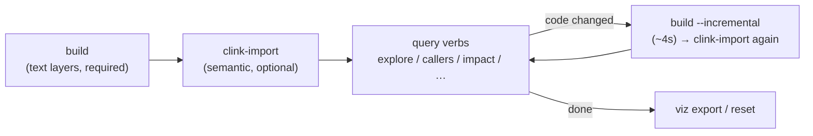
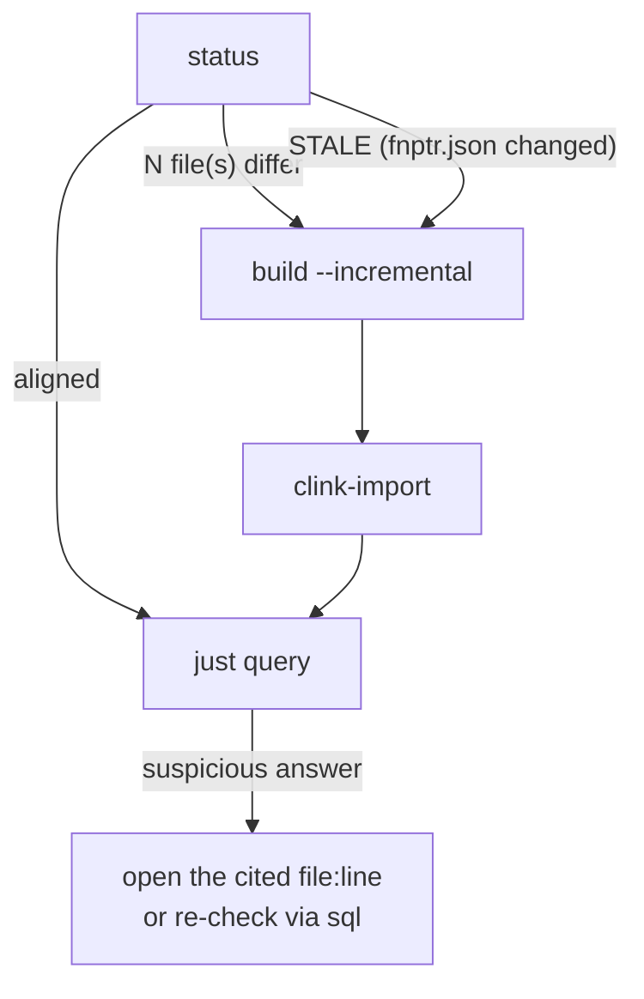
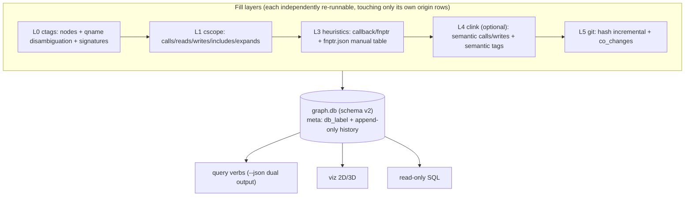

**English** · [繁體中文](README.md)

# ccodegraph — C/C++ knowledge graph (C-first, multi-engine, provenance-labelled)

A C/C++ code knowledge graph built for LLM agents: **zero-build** indexing
(ctags + cscope + heuristics), optional semantic layer (clink/libclang) and a
git layer, all filled into one SQLite database — every row stamped with
`origin` + `confidence` + tags. **Judgement is left to the LLM; uncertain data
is labelled, never deleted.**

---

# User zone

## Quick start (three minutes)

```bash
# deps: python3 (stdlib only), universal-ctags, cscope; optional: clink, git
./ccodegraph.py build -p <repo>              # step 1: build the graph (no build system needed, ~3s / 600 files; 7.6k-file kernel subtree ~22s)
./ccodegraph.py clink-import -p <repo>       # step 2 (optional): semantic layer
./ccodegraph.py explore some_function -p <repo>   # start asking!
```



## Command categories

**Build (basic)**

| Command | Purpose |
|---|---|
| `build -p <repo>` | build the graph → `.ccodegraph/graph.db`; after edits add `--incremental` (1-file change ≈ 4 s, provably equal to a full rebuild) |
| `clink-import -p <repo>` | optional semantic layer; **re-running IS incremental** (clink keeps per-file hashes); compile-DB ladder: `--compdb` merge → auto-detect → synthesize |

**Query (basic; every verb supports `--json` — the LLM picks the format)**

| Command | When |
|---|---|
| `explore X` | first move: definition + callers + callees + globals touched, one shot |
| `callers X` / `callees X` | who calls / what it calls (incl. fnptr/callback indirection and macro users) |
| `impact X -d N` | blast radius: "affects N symbols" + by-file groups (depth default 2) |
| `globals V` / `vars-of F` | who reads/WRITES a global / which globals F touches |
| `who-includes H` / `co-changed F` | header impact / git co-change |
| `viz [--format html2d\|html3d] [--focus X]` | offline interactive graph → `.ccodegraph/graph-<dim>.html` |

**Maintenance**

| Command | Purpose |
|---|---|
| `status` | health check: tool versions & paths, product sizes, database list, **drift list vs the source tree** |
| `dumpdb` | the DB's identity card: label, schema, **append-only write history**, per-layer stats |
| `schema` | the graph's self-introduction: which slots are filled, by whom, STALE warnings |
| `reset` | delete everything under `.ccodegraph/` (prints each removal) |
| `skill` | print the agent SKILL.md (air-gapped install: `skill > ~/.claude/skills/ccodegraph/SKILL.md`) |

## Routine maintenance flow



## Advanced

### Multiple compile_commands.json (one source tree, several targets)

```bash
./ccodegraph.py clink-import --compdb build1.json,build2.json,build3.json -p <repo>
```
File-level merge: for a shared file the **first** DB listing it wins (order =
priority); target-exclusive files are all kept; genuine rule conflicts are
reported one by one. **Limitation (first-wins)**: a file's alternative-config
semantics are invisible to the semantic layer once merged.

### One graph per config (when first-wins isn't enough)

`--db` is a universal parameter on every verb. Text layers are identical
across graphs; only the semantic layer differs by compile DB:

```bash
./ccodegraph.py build -p <repo> --db .ccodegraph/cfgA.db
./ccodegraph.py clink-import -p <repo> --db .ccodegraph/cfgA.db --compdb buildA.json
./ccodegraph.py callers foo -p <repo> --db .ccodegraph/cfgA.db
```
clink by-products follow the graph name (`cfgA.clink.db`) so configs don't
stomp each other. **Keep custom DBs under `.ccodegraph/`** (as above): `status`
lists them and `reset` cleans them; anywhere else works too, but is outside
status/reset reach — your path, your responsibility.

### Module grouping (module_mapping.csv)

```bash
# module_mapping.csv: col 1 = regex (matched against file paths,
# case-insensitive), col 2 = module name (Unicode welcome)
#   ^src/utils/,utils-layer
#   ^src/drivers/,drivers
./ccodegraph.py build -p <repo> --module-map module_mapping.csv
./ccodegraph.py viz -p <repo>        # same module, same color
```

### Tool paths

`CCODEGRAPH_{CTAGS,CSCOPE,CLINK,GIT}_PATH` env vars override the system PATH
lookup. (No libclang variable — it is linked into clink at its build time.)

## Installing the agent skill

```bash
mkdir -p ~/.claude/skills/ccodegraph
./ccodegraph.py skill > ~/.claude/skills/ccodegraph/SKILL.md   # method 1 (air-gapped friendly)
cp skills/ccodegraph/SKILL.md ~/.claude/skills/ccodegraph/     # method 2
```
The SKILL's core is its **RISK CHAPTER**: how each confidence level fails,
what `semantic:absent` really means (a parse-coverage flag, D14), ambiguous
candidates, STALE handling.

## Measured numbers (wpa_supplicant, 620 files; methodology in docs/)

| Metric | Value |
|---|---|
| Call-edge recall (28-edge cflow GT) | **28/28** (cscope alone 26) |
| fnptr dispatch / callback | 5/5 / 3/3 |
| build / incremental / no-op | **3.4 s** (90 s pre-D17) / 3.9 s / 3.8 s (incremental == full, normalized diff = 0, endpoint kinds included) |
| Real-LLM A/B (codex, 5 tasks) | tokens roughly even; **correctness 5/5 vs 3/5** (grep arm silently wrong twice) |

### Measured at scale (after the D17 crossref direct read, 2026-07-11; `/usr/bin/time -l`)

| repo | files | build | graph size |
|---|---|---|---|
| wpa_supplicant | 620 | 3.4 s | 14.4k nodes / 113k edges |
| redis (deps/ included) | 784 | 4.1 s | 20.1k nodes / 146k edges |
| Linux kernel subtree | 7,627 | **22.5 s** (median of 3; 3h15m pre-D17 = **521×**) | 427k nodes / 339k edges |
| Linux kernel full tree | 56,939 | **62 min** (pre-D17: killed unfinished at 14.5 h, 30-40 h extrapolated) | 6.2M nodes / 54.9M edges / 16 GB |

D17 = parse cscope.out directly (one pass replaces per-symbol queries); it
also fixed three classes of phantom bugs in cscope's own `-L` query engine —
engineering record in `docs/design.md` §8.5.6, bug evidence in
`docs/research/cscope-query-engine-bugs.md`, the four-tool kernel shootout in
`docs/research/llm-ab-v5-linux-kernel.md` (§4.1 is the post-D17 addendum).
Open problem at full-tree scale: same-name ambiguous attachment (D3) explodes
edge counts at 57k files (reads alone: 28.3M).

---

# Developer zone

## Required reading (in order)

1. [docs/requirement.md](docs/requirement.md) — **Why (W1–W7) and What**: the rationale behind every trade-off; first file for handover
2. [docs/design.md](docs/design.md) — **How**: Schema Contract (§1.5, every legal value enumerated), decision records **D1–D17** (including overturned ones and why), roadmap
3. [docs/traceability.md](docs/traceability.md) — every FR/NFR mapped to its verification
4. [docs/reviews/](docs/reviews/) — three codex red-team rounds and their dispositions (NFR6)
5. [docs/research/](docs/research/) — clink anatomy, token spike, six rounds of LLM A/B benchmarks (v1 pilot → v5 Linux kernel → v6 clangd-LSP shootout), cscope query-engine bug evidence (D17)

## Development SOP (rules paid for in blood)

- **Assert every patch**: a string replace that doesn't match must blow up,
  never no-op silently (bitten twice: the ccq CHANGELOG incident, the
  CSCOPE_DB rename incident)
- **Judge tests by exit code**, never by grepping output (Python 3.13's
  colorized unittest defeated the grep for several sessions); locally run
  `NO_COLOR=1 python3 -m unittest discover -s tests -t .`
- **Green at commit time**: ruff + mypy --strict + all three test layers;
  fixtures guard logic, **real repos guard reality** (wpa caught three bugs
  fixtures missed)
- Decisions go into design.md decision records **with their rationale**;
  overturned decisions are not deleted — they get a correction record (the
  D14 pattern)
- Honesty (P7): declare what you can't do, never return empty silently;
  prefer false negatives — fight misses with engine union, fight false
  positives with confidence + tags
- Releasing: CHANGELOG (Keep a Changelog) → version in both places
  (pyproject + VERSION) → tag → counts only when tri-platform CI is green

## Architecture at a glance



## Tests & lint

```bash
NO_COLOR=1 python3 -m unittest discover -s tests -t .   # judged by exit code
ruff check . && mypy ccodegraph.py
```
integration/e2e skip loudly when cscope/ctags are missing; clink tests use
`CCODEGRAPH_CLINK_PATH` pointing at a locally built binary.
