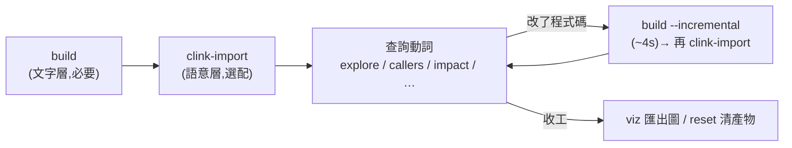
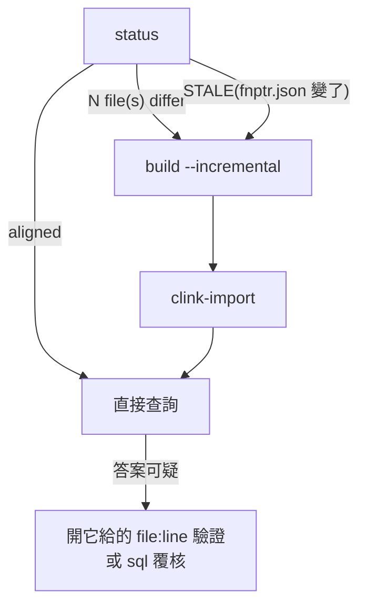
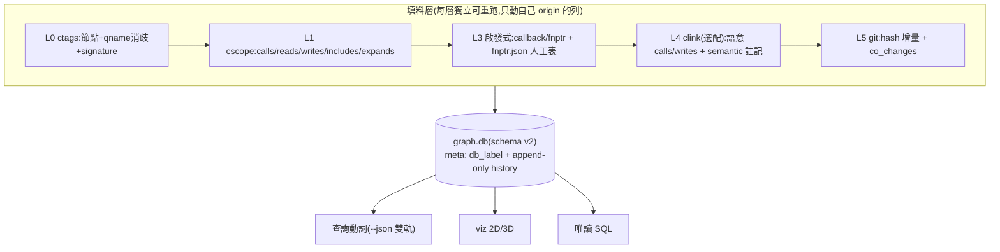

[English](README.en.md) · **繁體中文**

# ccodegraph — C/C++ 知識圖譜(C 優先、多引擎、標注出處與信心)

給 LLM/agent 用的 C/C++ 程式碼知識圖:**零 build 需求**建圖(ctags + cscope +
啟發式),選配語意層(clink/libclang)與 git 層,全部填進同一個 SQLite——
每筆資料標 `origin` + `confidence` + 標籤,**判讀交給大模型,不確定的資料
被標注、不被刪除**。

---

# 使用者專區

## 快速開始(三分鐘)

```bash
# 依賴:python3(標準庫)、universal-ctags、cscope;選配:clink、git
./ccodegraph.py build -p <repo>              # step 1:建圖(零 build,~3s / 600 檔;kernel 子樹 7.6k 檔 ~22s)
./ccodegraph.py clink-import -p <repo>       # step 2(選配):語意層
./ccodegraph.py explore some_function -p <repo>   # 開始問!
```



## 指令分類

**建立用(基礎)**

| 指令 | 作用 |
|---|---|
| `build -p <repo>` | 建圖 → `.ccodegraph/graph.db`;改碼後加 `--incremental`(改 1 檔 ≈ 4s,與全量 diff = 0) |
| `clink-import -p <repo>` | 選配語意層;**重跑即增量**(clink 內建每檔 hash);compile DB 階梯:`--compdb` 合併 → 自動偵測 → 合成 |

**查詢用(基礎;全部支援 `--json`,LLM 自選格式)**

| 指令 | 何時用 |
|---|---|
| `explore X` | 第一手:定義+callers+callees+全域讀寫,一發 |
| `callers X` / `callees X` | 誰呼叫 / 呼叫誰(含 fnptr/callback 間接、巨集使用) |
| `impact X -d N` | 改 X 炸到誰:「affects N symbols」+ 按檔分組(預設深度 2) |
| `globals V` / `vars-of F` | 誰讀寫全域 / 函式碰哪些全域 |
| `who-includes H` / `co-changed F` | header 影響面 / git 共變檔 |
| `viz [--format html2d\|html3d] [--focus X]` | 離線互動圖 → `.ccodegraph/graph-<dim>.html` |

**管理用**

| 指令 | 作用 |
|---|---|
| `status` | 健康檢查:工具版本與路徑、產物大小、DB 清單、**與程式碼的 drift 清單** |
| `dumpdb` | DB 身份證:label、schema、**append-only 寫入歷史**、各層統計 |
| `schema` | 圖的自我介紹:哪些格子填了、誰填的、STALE 警告 |
| `reset` | 清掉 `.ccodegraph/` 全部產物(逐項印出) |
| `skill` | 印出 agent 用 SKILL.md(內網安裝:`skill > ~/.claude/skills/ccodegraph/SKILL.md`) |

## 日常維護流程



## 進階功能

### 多份 compile_commands.json(一包原始碼 build 多個執行檔)

```bash
./ccodegraph.py clink-import --compdb build1.json,build2.json,build3.json -p <repo>
```
檔案層級合併:同檔取**第一份**提到它的規則(順序=優先權)、各 target 獨有檔聯集全收、
規則衝突逐筆回報。**限制(first-wins)**:同一檔在多個 config 下的不同語意視角,
合併後只保留優先權最高那份——另一個 config 的 `#ifdef` 分支在語意層不可見。

### 每個 config 一張圖(first-wins 不夠用時)

`--db` 是全動詞通用參數。文字層(nobuild)各圖相同,差別只在語意層吃哪份 compile DB:

```bash
./ccodegraph.py build -p <repo> --db .ccodegraph/cfgA.db
./ccodegraph.py clink-import -p <repo> --db .ccodegraph/cfgA.db --compdb buildA.json
./ccodegraph.py callers foo -p <repo> --db .ccodegraph/cfgA.db
```
clink 副產物自動跟隨圖名(`cfgA.clink.db`),多 config 不互踩。
**請把自訂 DB 放在 `.ccodegraph/` 下**(如上例):`status` 會列出所有 DB、`reset`
一併清除;放到別處也可以,但 status/reset 管不到——路徑自主,後果自負。

### 模組分群(module_mapping.csv)

```bash
# module_mapping.csv:欄1 = regex(對檔案路徑,英文不分大小寫)、欄2 = 模組名(可中文)
#   ^src/utils/,工具層
#   ^src/drivers/,驅動
./ccodegraph.py build -p <repo> --module-map module_mapping.csv
./ccodegraph.py viz -p <repo>        # 同模組同色分群
```

### 工具路徑

`CCODEGRAPH_{CTAGS,CSCOPE,CLINK,GIT}_PATH` 環境變數 > 系統 PATH。
(無 libclang 變數——它是 clink 建置期連結的,不由我們呼叫。)

## 給 agent 安裝 skill

```bash
mkdir -p ~/.claude/skills/ccodegraph
./ccodegraph.py skill > ~/.claude/skills/ccodegraph/SKILL.md   # 方法一(內網適用)
cp skills/ccodegraph/SKILL.md ~/.claude/skills/ccodegraph/     # 方法二
```
SKILL 核心是**風險判讀章**:每級 confidence「怎麼錯」、`semantic:absent` 的真義
(解析覆蓋旗標,D14)、ambiguous 標籤、STALE 處理。

## 實測數字(wpa_supplicant 620 檔;方法見 docs/)

| 指標 | 數字 |
|---|---|
| 呼叫邊召回(cflow 28 邊 GT) | **28/28**(cscope 單獨 26) |
| fnptr 分派 / callback | 5/5 / 3/3 |
| 建圖 / 增量 / 無變更 | **3.4s**(D17 前 90s)/ 3.9s / 3.8s(增量與全量 normalized diff = 0,端點含 kind) |
| 真 LLM A/B(codex,5 任務) | token 打平;**正確性 5/5 vs 3/5**(grep 臂兩題靜默答錯) |

### 規模實測(D17 crossref 直讀之後,2026-07-11;`/usr/bin/time -l`)

| repo | 檔數 | 建圖 | 圖規模 |
|---|---|---|---|
| wpa_supplicant | 620 | 3.4s | 14.4k 節點 / 113k 邊 |
| redis(含 deps/) | 784 | 4.1s | 20.1k 節點 / 146k 邊 |
| Linux kernel 子樹 | 7,627 | **22.5s**(N=3 中位數;D17 前 3h15m = **521×**) | 427k 節點 / 339k 邊 |
| Linux kernel 全樹 | 56,939 | **62min**(D17 前 14.5h 未完殺掉,外推 30-40h) | 6.2M 節點 / 54.9M 邊 / 16GB |

D17 = 直接解析 cscope.out(單遍取代逐符號查詢),順帶修掉 cscope 自身
`-L` 查詢引擎的三類幻影 bug——工程記錄見 `docs/design.md` §8.5.6,bug
證據見 `docs/research/cscope-query-engine-bugs.md`,kernel 四工具對決見
`docs/research/llm-ab-v5-linux-kernel.md`(§4.1 為 D17 後追記)。全樹的
開放問題:同名歧義掛靠(D3)在 57k 檔規模讓邊數爆炸(reads 一項 28.3M)。

---

# 開發者專區

## 必讀知識檔(依序)

1. [docs/requirement.md](docs/requirement.md) — **Why(W1–W7)與 What**:每條取捨的原因,交接第一份
2. [docs/design.md](docs/design.md) — **How**:Schema Contract(§1.5,合法值全列)、決策記錄 **D1–D17**(含被推翻的與為什麼)、roadmap
3. [docs/traceability.md](docs/traceability.md) — 每條 FR/NFR 對到哪個測試
4. [docs/reviews/](docs/reviews/) — 三輪 codex 紅隊審查與處置(NFR6 制度)
5. [docs/research/](docs/research/) — clink 解剖、token spike、LLM A/B benchmark 六輪(v1 先導 → v5 Linux kernel → v6 clangd LSP 對決)、cscope 查詢引擎 bug 證據(D17)、教學層方法論、benchmark 方法論

## 開發 SOP(血淚換來的規則,違反必踩)

- **patch 一律 assert**:字串 replace 沒中要炸,不准靜默(此坑咬過兩次:ccq CHANGELOG 事故、CSCOPE_DB 改名事故)
- **測試判定看 exit code**,不 grep 輸出(Python 3.13 彩色輸出騙過 grep 好幾輪);本地跑 `NO_COLOR=1 python3 -m unittest discover -s tests -t .`
- **commit 時全綠**:ruff + mypy --strict + 三層測試(unit/integration/e2e);fixture 管邏輯、**真 repo 管現實**(wpa 抓過 fixture 過不了的 bug 三次)
- 決策要進 design.md 決策記錄,**含取捨原因**;被推翻的決定不刪、加修正記錄(D14 模式)
- 誠實原則(P7):超出能力明講,不靜默回空;寧可漏報絕不誤報——漏報用多引擎聯集治,誤報用 confidence+標籤治
- 發版:CHANGELOG(Keep a Changelog)→ 版號雙處(pyproject + VERSION)→ tag → CI 三平台綠才算數

## 架構速覽



## 測試與 lint

```bash
NO_COLOR=1 python3 -m unittest discover -s tests -t .   # 判 exit code
ruff check . && mypy ccodegraph.py
```
integration/e2e 缺 cscope/ctags 自動 skip 並明講;clink 測試用 `CCODEGRAPH_CLINK_PATH` 指到本地建的 binary。
